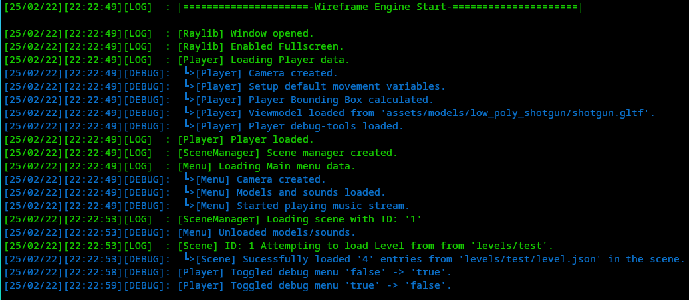

# Wireframe Game / Game engine

A game / game engine using [Raylib](https://github.com/raysan5/raylib) with the goal to follow simplicity and have a `"Wireframe"` visual style

> [!TIP]
> Please also check out its brother project [Wireframe Editor](https://github.com/LeaoMartelo2/wireframe_editor).\
> A tool for generating Levels for this project.

## Compiling

The project is designed in such a way, that compiling should not be a hard task. Thus making compiling extremely convenient and quick.

### Linux
 - Dependencies
    - [Make](https://www.gnu.org/software/make/)
    - [gcc](https://gcc.gnu.org/)
    - Any other dependencies are baked in the project itself.

 - To compile, just run `make` at the project's root.
 - The final executable is named `wireframe`.

### Microsoft Windows

> [!WARNING]
> Build support for Microsoft Windows is not implemented yet.

> [!NOTE]
> You can cross-compile from Linux to Microsoft Windows.\
> Requires: [x86_64-w64-mingw32-g++](https://www.mingw-w64.org/) + everything from Linux dependencies.\
> Run `make win`, the final executable is named `wireframe.exe`

### Debug builds

You can pass the following argument to make:
`make DEBUG=1`
to get a debug build of the project, differences in the debug build are:

 - Visual representation of the player's bounding box on where the collision happened.
 - Visual representation of movement/direction vector

 as well as getting a message on screen all times indicating its a debug build.

#### Some issues with the debug build:
 - The camera de-syncs withe the player:
    This is due the order game updates happen in the debug build. The camera will only get updated on the next frame, relative to the player's update, instead of waiting for the previous iteration to update itself.
 - Some weird visual artifacts:
    This is due the order of updates being different than expected on debug builds again. Some parts of the screen drawing code do not expect `BeginMode3D()` to be enabled at that time, but they're are required for other debug build features.

## Engine structure

> [!IMPORTANT]
> This information is subject to get outdated at any time.

The engine structure goal can be represented as such:

<pre>
Engine Instance
 ┃
 ┣ Scene Manager 
 ┃      ┃
 ┃      ┣ Player
 ┃      ┃   ┗ ~ Player data ~
 ┃      ┃
 ┃      ┣ Scene (1)
 ┃      ┃   ┃
 ┃      ┃   ┗ Level
 ┃      ┃       ┗ ~ Level data ~
 ┃      ┃
 ┃      ┗ Scene (2)
 ┃          ┃
 ┃          ┗ (Other)
 ┃              ┗ ~ Some data relevant to the scene ~
</pre>

 

| Item          | Description                                                          | 
| ---           | ---                                                                  |
| Scene manager | Manages all the scenes in the game and the player                    |
| Scene         | Manages level data, such as the current level and current game logic |
| Player        | Player Character                                                     |
| (Other)       | Used to represent generic data in the board                          |

### The Scene layout

This structure allows you to have multiple scenes and they behave differently between eachother.\
Each scene can hold a level and data related to it. This way you can think of each scene as a different map you load in.

### Why is the player a member of the Scene manager?

The Player being a child of the Scene Manager instead of the current running scene, allows to easily have player data be persistent between scenes
otherwise you would have a need to create player copies, that would frequently get out of sync and get hard to manage.\
Doing it this way, in the other hand, allows you to just pass down a pointer of the player instance at the manager.

## Logging

This projects integrates with [LogNest](https://github.com/LeaoMartelo2/LogNest).

The engine, by default, writes its log to `latest.log` at the main executable path.

For convenience, it's also provided a copy off [nestreader](https://github.com/LeaoMartelo2/nestreader)\
The CLI tool will automatically print the log, while also coloring each log type with a corresponding color.

## Design choices

The project was originally started in `C`, now ported to `C++`

The decision of moving to C++ is due several factors relating to the project structure growing more complex then i would like.

Some of the reasons can be boiled down to:
 - Dealing with memory was getting extremely "boilerplated" in C.
 - Easier generics.
 - Some `light use` of object oriented features prove themselves useful. (keyword `light use`)

Due the simplicity goal, there is avoidance in the use of `"modern C++"`, and most of the C++ code is written in C like style.

Some of the highlighted features are:
 - std::vector - This one is allowed, even though it's using templates, should be used sparingly.
 - std::string - This one is allowed, use `char *` if possible.
 - namespacing - Avoid at all costs, otherwise keep to minimum.
 - Function / Operator overloading - Avoid at all costs, exceptions are different Class constructors(ie. "copy constructor").
 - auto - Avoid when applicable. 
 - smart pointers - Keep to a minimum.

