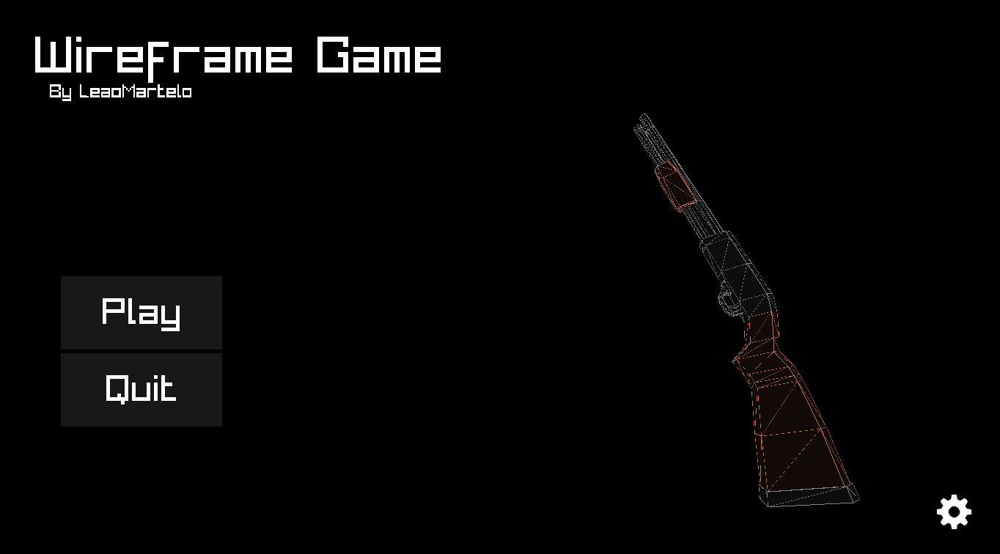
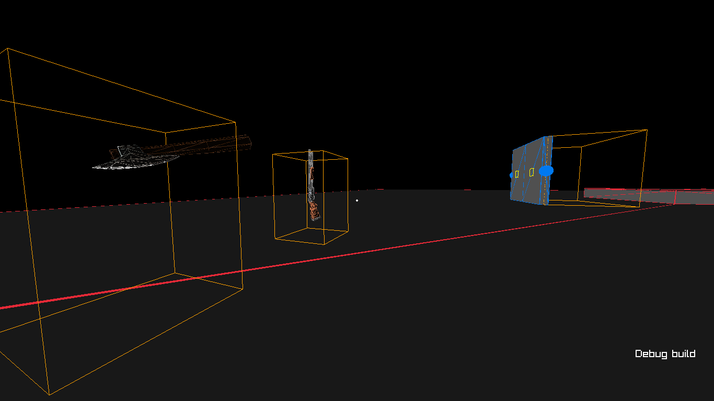

# Wireframe Game / Game engine

A game / game engine using [Raylib](https://github.com/raysan5/raylib) with a `"Wireframe"` visual style

> [!TIP]
> Please also check out its brother project [Wireframe Editor](https://github.com/LeaoMartelo2/wireframe_editor).\
> A tool for generating Levels for this project.

## Compiling

The project is designed in such a way that compiling should not be a hard task. Thus making compiling extremely convenient and quick.

### Linux
 - Dependencies
    - [Make](https://www.gnu.org/software/make/) (GNU make or similar)
    - [gcc](https://gcc.gnu.org/) or [clang](https://clang.llvm.org/) (edit the `Makefile` to change the compiler)
(or any compiler with C++20 support)
    - C and C++ runtime (libstdc++)
    - Any other dependencies should be baked in the project itself.

 - To compile, just run `make` at the project's root.
 - The final executable is named `wireframe`.

### Microsoft Windows

> [!WARNING]
> Build support for Microsoft Windows is not implemented yet.

> [!NOTE]
> You can cross-compile from Linux to Microsoft Windows.\
> Requires: [x86_64-w64-mingw32-g++](https://www.mingw-w64.org/) + everything from Linux dependencies.\
> Run `make win`, the final executable is named `wireframe.exe` and can be run on windows.

### Other Unix-like (BSD / MacOS)

> [!WARNING]
> Build support for MacOs and the BSD-family isn't implemented yet.

> [!NOTE]
> As their structure ends up being very similar to Linux, you can hack your way to a working build on said systems by grabbing a copy of [Raylib 5.5's source code](https://github.com/raysan5/raylib/releases/tag/5.5) and supplying your own built static library to link against.

### Debug builds

You can pass the following argument to make:
`make DEBUG=1`
to get a debug build of the project

 Item Drops and a Door with the debug mode bounding boxes shown 

The debug mode currently allows you to see bounding boxes / hitboxes of most dynamic objects in the game, as well as giving some helpfull keybinds for debugging.

### Release builds

Use the Make target `release` to generate a release build. This does the following:

- Disables debug info.
- Disables `[DEBUG]` level on logging.
- Enables Optimizations. (-O2 by default).
- Builds: The default target and win. (cross compile to Windows)
- Packs the levels and needed assets to a directory named Release and compacts it accordingly to its target platform.

Not much different from a regular build without debug flag, exept optimizations.

## Logging

This projects integrates with [LogNest](https://github.com/LeaoMartelo2/LogNest).

The engine, by default, writes its log to `latest.log` at the main executable path.

For convenience, it's also suggested [nestreader](https://github.com/LeaoMartelo2/nestreader)\
The CLI tool will automatically print the log, while also coloring each log type with a corresponding color.

## Documentation

WIP.
