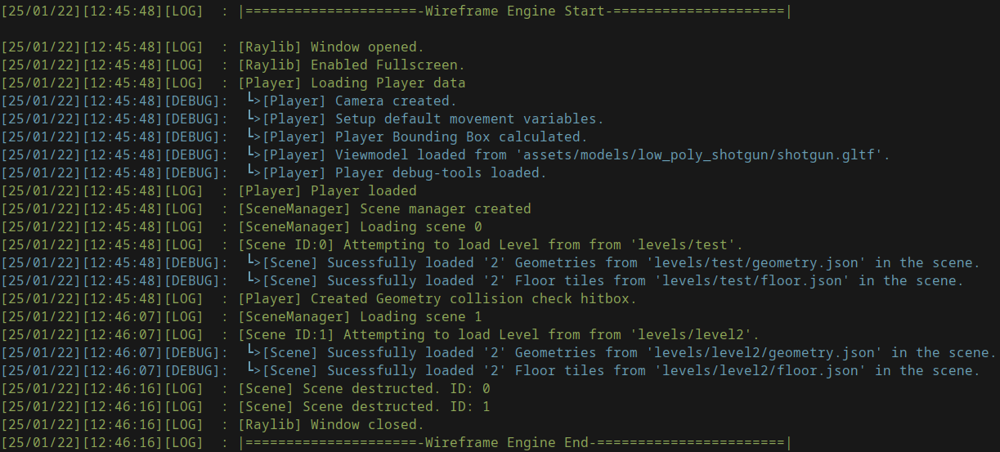

# Wireframe Game / Game engine

Game engine originaly made in `C`, now ported to `C++`, using [RayLib](https://github.com/raysan5/raylib).
The goal of the engine, is to follow simplicity and provide a `Wireframe` visual style.

Due the simplicity goal, there is little to no use of "modern C++", and most of the C++ code is written in C style.

> [!TIP]
> Please also check out it's brother project [Wireframe Editor](https://github.com/LeaoMartelo2/wireframe_editor).\
> A tool for generating Levels for this project.

## Compiling

### Linux
 - Dependencies
    - [Make](https://www.gnu.org/software/make/)
    - [gcc](https://gcc.gnu.org/)
    - Any other dependencies are baked in the project itself.

 - To compile, just run `make -j4` at the project's root.
 - This will provide you with a 'wireframe' binary.

### Microsoft Windows

 - Not Implemented.

> [!NOTE]
> You can cross-compile from Linux to Microsoft Windows.\
> Requires: [x86_64-w64-mingw32-g++](https://www.mingw-w64.org/) + everything from Linux requireaments.\
> Run `make -j4 win`, you'll be left out with `wireframe.exe`\

## Engine structure

> [!IMPORTANT]
> This information is subject to get outdated at any time.

The engine structure goal can be represented as such:

<pre>
Engine Instance
 ┃
 ┣ Scene Manager 
 ┃      ┣ Scene (1)
 ┃      ┃   ┃
 ┃      ┃   ┣ Player
 ┃      ┃   ┃   ┗ ~ Player relevant data ~
 ┃      ┃   ┃
 ┃      ┃   ┗ Level
 ┃      ┃       ┗ ~ Level data
 ┃      ┃
 ┃      ┗ Scene (2)
 ┃          ┃
 ┃          ┗ (Other)
 ┃              ┗ ~ Some data relevant to the scene ~
</pre>

 

| Item          | Description                                                      | 
| ---           | ---                                                              |
| Scene manager | Manages all the scenes in the game, including menus and gameplay |
| Scene         | Manages level data, such as level loading, and a player instance |
| Player        | Player Character                                                 |
| (Other)       | Used to represent any kind of data                               |

## Logging

This projects integrates with [LogNest](github.com/LeaoMartelo2/LogNest).

The engine, by default, writes it's log to `latest.log` at the main executable path.

For convenience, it's also provided a [Shell script](./log.sh)\
This script will keep automatically print the log, while also coloring each log type with a corresponding color.
