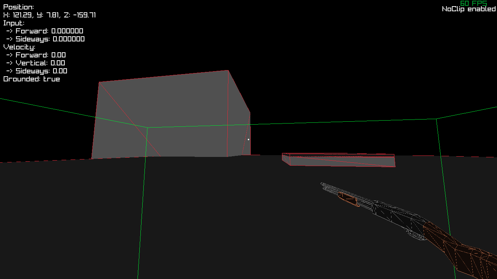

# Wireframe Game / Game engine

Game engine originaly started in `C`, now being developed in `C++`, using [RayLib](https://github.com/raysan5/raylib).
The goal of the engine, is to be simple and have a `Wireframe` visual style.

Due the simplicity goal, there is avoidance in the use of `"modern C++"`, and most of the C++ code is written in C style.

> [!TIP]
> Please also check out its brother project [Wireframe Editor](https://github.com/LeaoMartelo2/wireframe_editor).\
> A tool for generating Levels for this project.

## Compiling

### Linux
 - Dependencies
    - [Make](https://www.gnu.org/software/make/)
    - [gcc](https://gcc.gnu.org/)
    - Any other dependencies are baked in the project itself.

 - To compile, just run `make` at the project's root.
 - This will provide you with a 'wireframe' binary.

### Microsoft Windows

 - Not Implemented.

> [!NOTE]
> You can cross-compile from Linux to Microsoft Windows.\
> Requires: [x86_64-w64-mingw32-g++](https://www.mingw-w64.org/) + everything from Linux dependencies.\
> Run `make win`, you'll be left out with `wireframe.exe`

## Engine structure

> [!IMPORTANT]
> This information is subject to get outdated at any time.

The engine structure goal can be represented as such:

<pre>
Engine Instance
 ┃
 ┣ Scene Manager 
 ┃      ┃
 ┃      ┣ Player
 ┃      ┃   ┗ ~ Player data ~
 ┃      ┃
 ┃      ┣ Scene (1)
 ┃      ┃   ┃
 ┃      ┃   ┗ Level
 ┃      ┃       ┗ ~ Level data ~
 ┃      ┃
 ┃      ┗ Scene (2)
 ┃          ┃
 ┃          ┗ (Other)
 ┃              ┗ ~ Some data relevant to the scene ~
</pre>

 

| Item          | Description                                                          | 
| ---           | ---                                                                  |
| Scene manager | Manages all the scenes in the game and the player                    |
| Scene         | Manages level data, such as the current level and current game logic |
| Player        | Player Character                                                     |
| (Other)       | Used to represent generic data in the board                          |

This structure allows you to have multiple scenes, each with a different level and even scene specific code \
The Player being a child of the Scene Manager instead of the current running scene, allows to have player data to be persistent between scenes,\
otherwise you would have a different player instance for each scene, or need to create player copies, that would frequently get out of sync.\
Doing it this way, in the other hand, allows you to just pass down a pointer of the player instance at the manager.\

## Logging

This projects integrates with [LogNest](https://github.com/LeaoMartelo2/LogNest).

The engine, by default, writes its log to `latest.log` at the main executable path.

For convenience, it's also provided a [Shell script](./log.sh)\
This script will automatically print the log, while also coloring each log type with a corresponding color.
